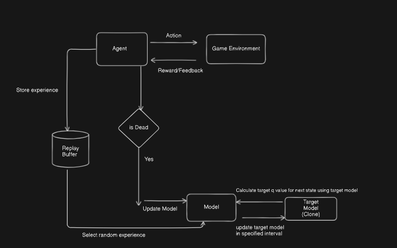
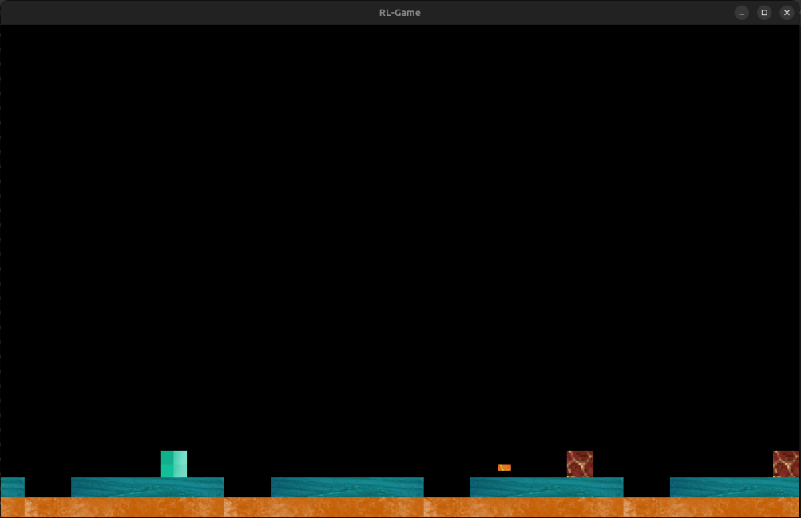

# Reinforcement Learning Game

A single agent RL model using DQN. The game is a simple 2d endless runner written in cpp (SFML graphics library) & The model is written in python(pytorch). The goal of the agent is to survive as long as possible to increase score. Both Game and model are seperate application process where they communicate through shared memory region :  game sending reward as a response to action taken by the agent

### Images

 
 
